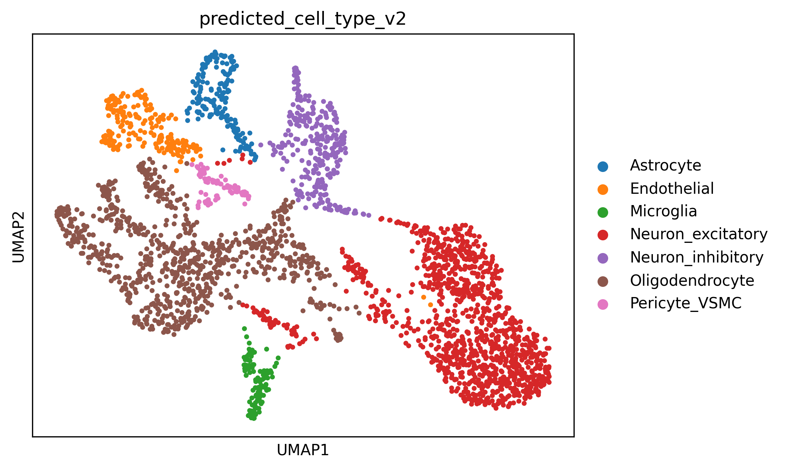
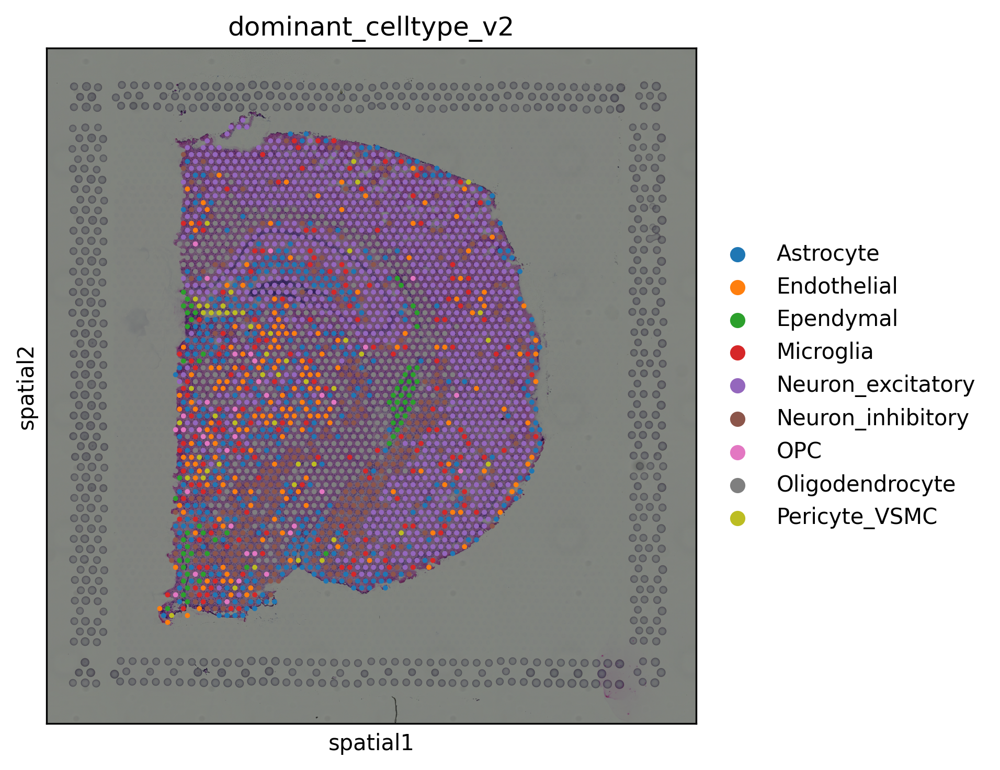
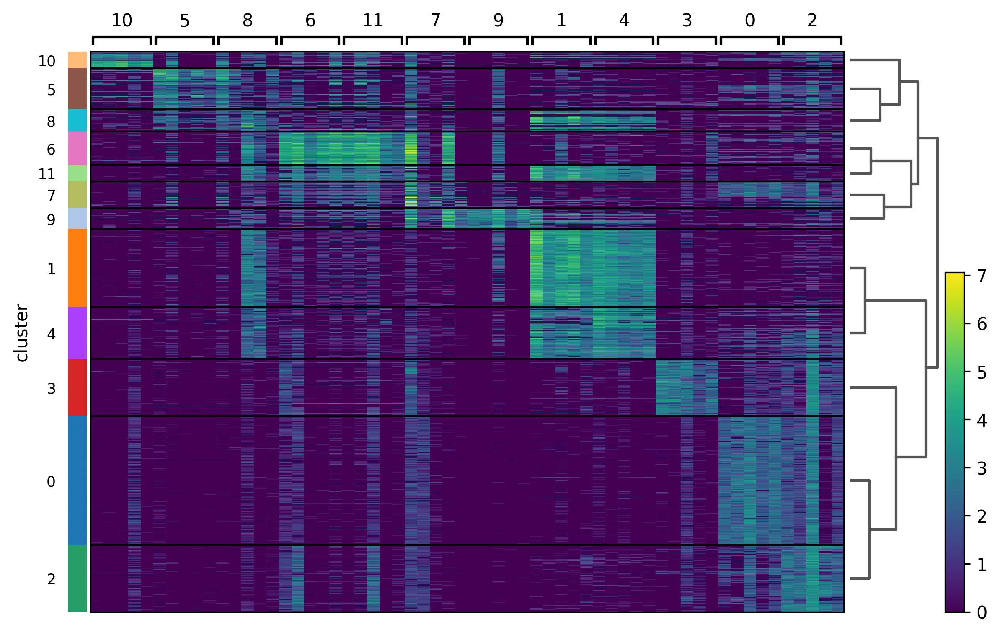

# LLM Guided scRNA seq and Spatial Transcriptomics Analysis of Mouse Brain

## Project overview

This project builds an end to end workflow that combines single cell RNA sequencing, spatial transcriptomics, rule based cell type annotation, and Gemini assisted biological interpretation in a mouse brain dataset.

The goal was not just to run a standard clustering pipeline. The main idea was to test whether a large language model could be used in a careful and useful way during biological analysis. Python was used for the actual computation, while Gemini was used as an interpretation and review layer.

The project has two connected parts.

First, I analyzed a mouse brain scRNA seq reference dataset to perform quality control, dimensionality reduction, clustering, marker gene discovery, and broad cell type annotation.

Second, I used a mouse brain spatial transcriptomics dataset to score broad cell type signatures across spatial spots and map dominant cell type patterns across tissue.

A key part of the project is that the notebook keeps the actual development story. The first pass annotation was not perfect. Gemini review helped identify a biologically implausible cluster assignment, which led to a corrected marker dictionary and a refined annotation workflow.

## Selected results

### scRNA seq UMAP by corrected broad cell type


### Spatial transcriptomics, dominant broad cell type by spot


### Marker gene heatmap across scRNA seq clusters

---

## Why I built this project

Single cell and spatial transcriptomics workflows often produce results that are statistically correct but still require biological review. Cluster labels can be too broad, marker dictionaries can be incomplete, and broad annotations can silently fail if important cell classes are missing.

I wanted to build a project that shows three things at once:

1. I can perform standard single cell and spatial transcriptomics analysis in Python.
2. I understand that annotation is an iterative biological reasoning process, not just a coding step.
3. I can use an LLM in a realistic way, not as a black box predictor, but as a reviewer that checks whether marker based interpretations make biological sense.

This project is therefore as much about analytical reasoning as it is about software.

---

## Local data setup

This repository does **not** include the raw local datasets. The `data/` folder is ignored in Git, and the scRNA seq reference file is also kept local.

To run the notebook locally, place the required files in your working directory as follows:

- `zeisel_mouse_brain.h5ad` in the project root directory
- spatial transcriptomics files inside the `data/` folder

These local data files are intentionally not committed to GitHub.

---

## Datasets used

### 1. scRNA seq reference
Zeisel mouse brain dataset in `.h5ad` format.

This dataset was used as the single cell reference for:
- quality control
- clustering
- marker gene discovery
- broad cell type annotation

### 2. Spatial transcriptomics dataset
Visium adult mouse brain dataset loaded with Squidpy.

This dataset was used for:
- spatial clustering
- spatial visualization
- cell type signature scoring across spatial spots
- broad tissue composition analysis

---

## Workflow summary

## Part 1. scRNA seq analysis

### 1. Quality control
I first computed standard QC metrics for the Zeisel mouse brain dataset, including:
- total counts per cell
- number of genes detected per cell
- mitochondrial percentage

Instead of choosing QC thresholds blindly, I inspected summary statistics, quantiles, violin plots, scatter plots, and histograms. Gemini was then used to review the QC summary and suggest conservative thresholds.

The final QC thresholds used were:
- minimum genes per cell = 1000
- maximum genes per cell = 7500
- maximum mitochondrial percentage = 20

These thresholds were chosen conservatively because the dataset already appeared partially preprocessed rather than raw droplet output.

### 2. Dimensionality reduction and clustering
After filtering, the data were normalized, log transformed, and stored in `.raw` before highly variable gene selection.

I then:
- selected 2000 highly variable genes
- scaled the data
- ran PCA
- inspected the PCA variance ratio elbow plot

The PCA variance ratio plot flattened around 10 principal components, so I used 10 PCs rather than a larger default value.

Using these PCs, I computed:
- nearest neighbor graph
- UMAP
- Leiden clusters

### 3. Marker gene discovery
For each cluster, marker genes were identified using Wilcoxon rank based differential expression with `sc.tl.rank_genes_groups`.

These marker genes were visualized with:
- ranked marker plots
- heatmaps

A marker table was also extracted into a structured dataframe for downstream interpretation.

---

## Part 2. First pass annotation

The initial broad cell type annotation used a rule based marker dictionary with major brain classes such as:
- excitatory neurons
- inhibitory neurons
- oligodendrocytes
- OPCs
- astrocytes
- microglia
- endothelial cells

At first, this annotation was too limited because the marker dictionary did not include some vascular mural cell identities.

This created an important failure case.

One cluster was initially labeled as **Oligodendrocyte**, but its top markers included genes such as:

- `Acta2`
- `Myh11`
- `Tagln`
- `Myl9`
- `Mylk`
- `Tpm1`
- `Tpm2`

These genes are much more consistent with **Pericyte or Vascular Smooth Muscle Cell** identity than oligodendrocyte identity.

---

## Part 3. Gemini assisted annotation review

This is the main conceptual contribution of the project.

Gemini was not used to generate cluster labels from scratch. Instead, it was used to review the first pass annotation by looking at:
- the predicted broad cell type
- the top marker genes for each cluster
- the biological plausibility of the assignment

For selected clusters, Gemini was asked to:
1. evaluate whether the predicted cell type was reasonable
2. suggest possible alternative identities
3. explain which marker genes supported the interpretation
4. mention uncertainty and limitations

This helped in two ways.

First, Gemini confirmed several clusters that already looked correct, such as:
- excitatory neuronal clusters with markers like `Gria1`, `Gria2`, and `Neurod6`
- oligodendrocyte clusters with markers like `Plp1`, `Mal`, `Ugt8a`, `Aspa`, and `Ermn`

Second, Gemini caught biologically implausible assignments, especially the mislabeled mural cell cluster.

This was useful because it showed that the first pass annotation logic was incomplete rather than the clustering being wrong.

---

## Part 4. Corrected annotation

After Gemini review, I expanded the marker dictionary to include additional brain associated cell classes, especially:
- Pericyte_VSMC
- Ependymal

I also corrected an important technical issue in the annotation workflow.

The first pass annotation had been influenced by the scaled highly variable gene matrix. For corrected annotation, I instead used the **full log normalized matrix stored in `.raw`**, which is more appropriate for marker based scoring.

The corrected annotation therefore used:
- cluster labels from the clustered object
- expression values from the full log normalized matrix
- an expanded marker dictionary

This produced more biologically plausible broad cell type assignments.

A key corrected result was:

- **Cluster 10**, initially mislabeled as Oligodendrocyte, was reassigned as **Pericyte_VSMC**, which Gemini strongly supported based on its contractile vascular marker profile.

This step is intentionally preserved in the notebook because it reflects the real development and debugging process.

---

## Part 5. Spatial transcriptomics analysis

Using the corrected marker dictionary, I then analyzed the Visium mouse brain spatial dataset.

### 1. Spatial preprocessing
The spatial dataset was:
- QC filtered to tissue spots
- normalized
- log transformed
- reduced to highly variable genes
- scaled
- embedded using PCA and UMAP
- clustered with Leiden

### 2. Cell type signature scoring across spatial spots
For each corrected brain cell class, I scored marker gene signatures across spatial spots using `sc.tl.score_genes`.

For each spot, the dominant cell type was defined as the highest scoring broad cell type signature.

This produced a broad spatial cell type map.

### 3. Spatial biological interpretation
The spatial transcriptomics result identified dominant cell type patterns across 2702 spatial spots.

The dominant broad cell type counts were:

- Neuron_excitatory = 1043
- Oligodendrocyte = 425
- Astrocyte = 394
- Neuron_inhibitory = 324
- Endothelial = 183
- Microglia = 180
- Ependymal = 68
- Pericyte_VSMC = 49
- OPC = 36

This indicates a mouse brain tissue section strongly enriched in neural populations, with excitatory neurons as the most prevalent dominant signal, followed by abundant oligodendrocytes and astrocytes.

Gemini was then used again to summarize the tissue composition and discuss the limitations of spot based spatial transcriptomics.

---

## Biological interpretation

Several biologically meaningful patterns emerged from the analysis.

### 1. The tissue is neuron rich
The spatial transcriptomics data were dominated by neuronal signatures, especially excitatory neurons. This is consistent with expected brain tissue composition and supports the idea that the corrected marker dictionary captured major neuronal identities reasonably well.

### 2. Glial populations are substantial
Oligodendrocytes and astrocytes were both abundant in the spatial data. This is biologically sensible because:
- oligodendrocytes are expected in myelinated brain regions
- astrocytes are widely distributed and support neuronal homeostasis

### 3. Vascular support cells were present but not dominant
Endothelial cells and Pericyte_VSMC signatures were detected in smaller numbers, which is expected for vascular associated populations in a brain tissue section.

### 4. Some clusters remain broad or ambiguous
Not all clusters were cleanly subtype resolved. For example, some neuronal clusters showed strong general neuronal identity but weaker evidence for a specific excitatory or inhibitory subtype based only on the top ten markers. One glial cluster also showed mixed astrocytic and oligodendrocytic features.

This is expected in real single cell analysis and is one reason why the project uses Gemini as an interpretation layer rather than a final authority.

---

## Why the LLM layer matters here

The LLM was useful in this project because it acted as a **biological reviewer**, not as a replacement for computation.

Its role was to:
- review QC summaries and suggest conservative thresholds
- evaluate whether marker based cluster labels were biologically plausible
- catch annotation mismatches caused by incomplete marker dictionaries
- explain broad cell type identities and uncertainty
- summarize spatial tissue composition in readable scientific language

This makes the workflow more realistic than a standard notebook that stops after clustering and marker plotting.

---

## Key takeaway

The most important lesson from this project is that annotation should be treated as an iterative process.

The workflow improved because:
1. the first pass annotation was tested
2. Gemini detected a biologically implausible label
3. the marker dictionary was expanded
4. annotation was rerun on the full log normalized matrix
5. the corrected labels were then used in the spatial analysis

That development story is intentionally preserved because it reflects how real analysis improves.

---

## Repository structure

```text
outputs/
    saved figures
    CSV tables
    Gemini review text files

llm_guided_scrna_spatial_mouse_brain.ipynb
README.md
.env.example
.gitignore